# FantasyEarthZero-props

FantasyEarthZero props data

小物・施設モデル **15種 / 28モデル** を収録しています。各モデルは Blender 用 (`Blender/*.blend`) と元データ (`Model/*.mdl`, `*.tex`, `*.anm`) があります。

> プレビュー画像は各 .blend を Blender 5.2 (EEVEE) で自動レンダリングしたものです（正面やや右上から）。
> `_hit` / `_m` / `_s` / `_stand` / `_light` / `_null` はゲーム内仕様用のファイルのため一覧から省いています。

## 一覧

| 種類 | 数 | サムネイル |
|---|:---:|:---:|
| [openshop](#openshop) | 1 | 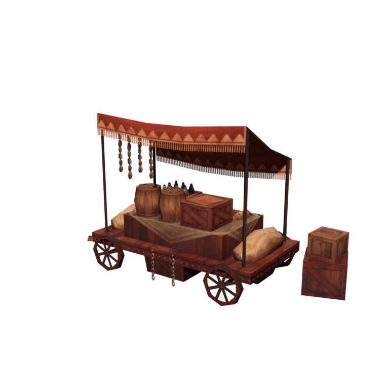 |
| [alchemy_shop](#alchemy_shop) | 2 | 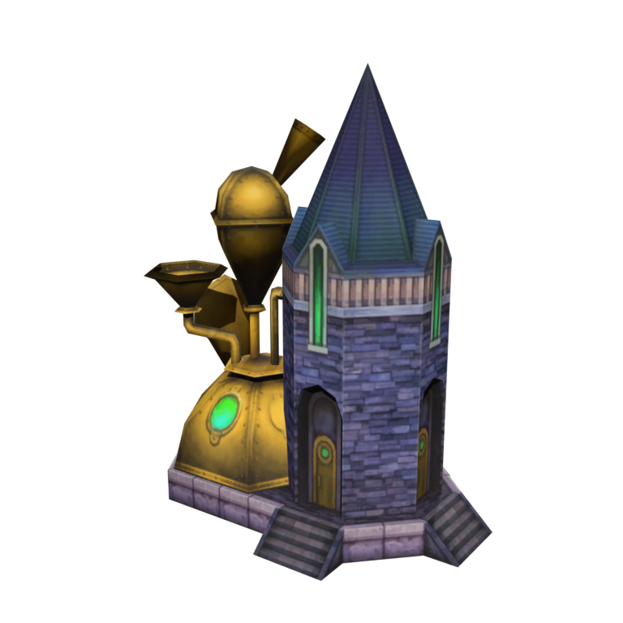 |
| [arms_store](#arms_store) | 1 | 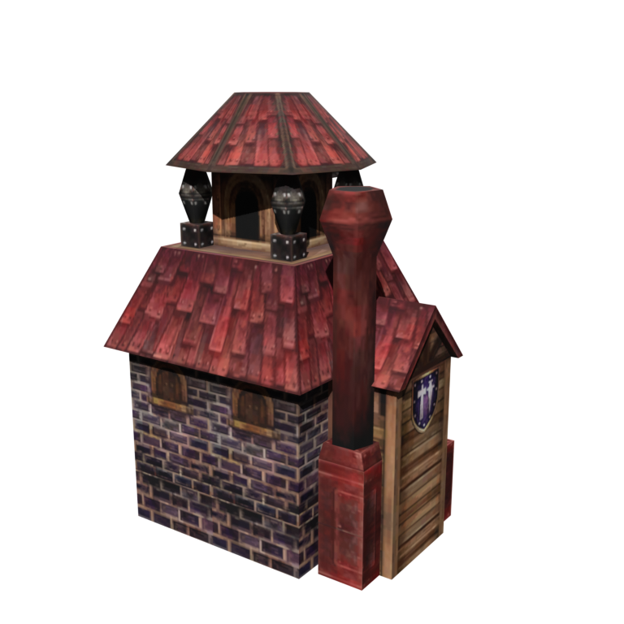 |
| [magic_store](#magic_store) | 1 | 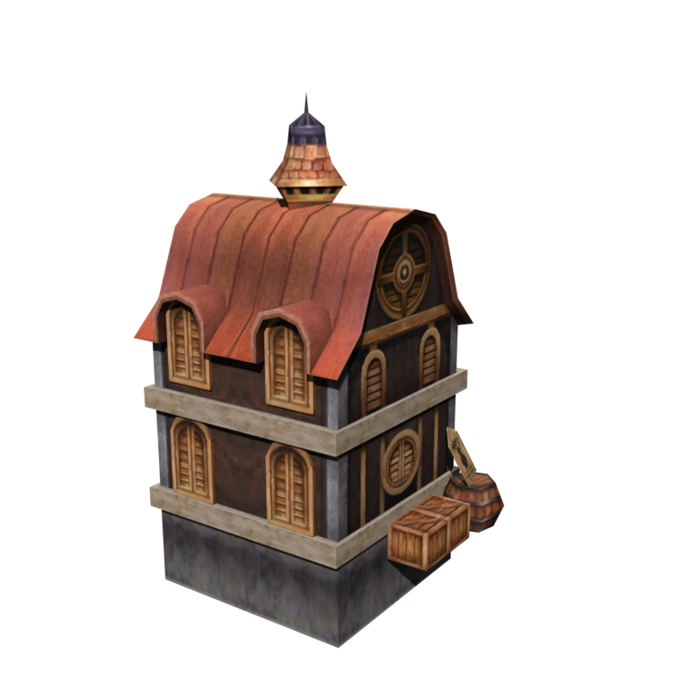 |
| [bar](#bar) | 1 | 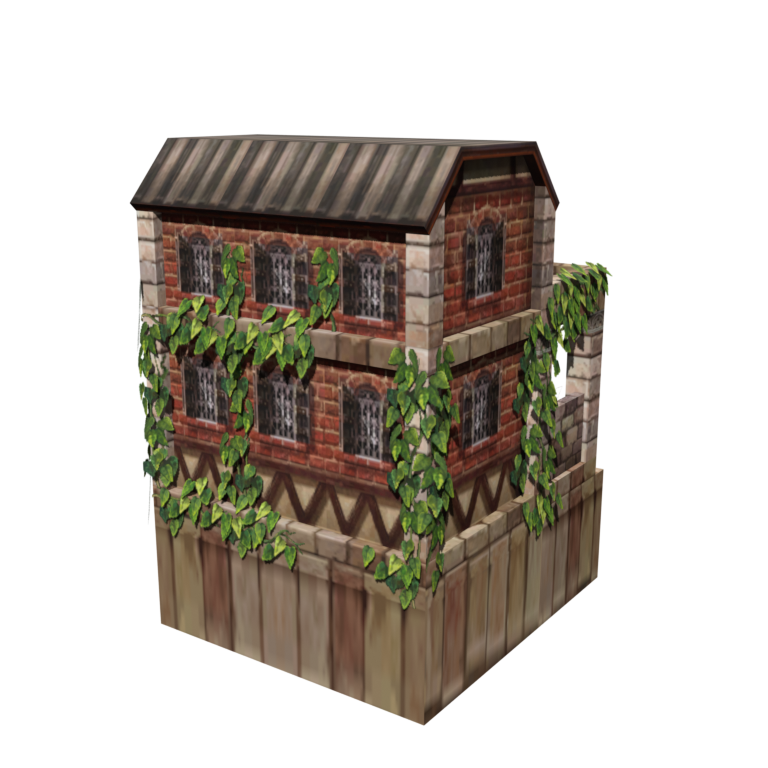 |
| [inn](#inn) | 1 | 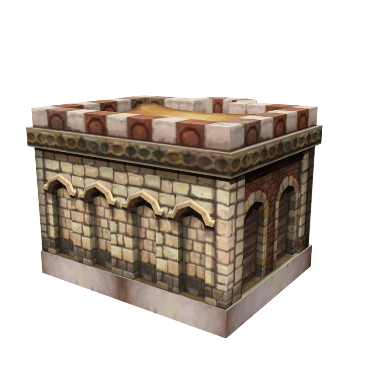 |
| [house00](#house00) | 3 | 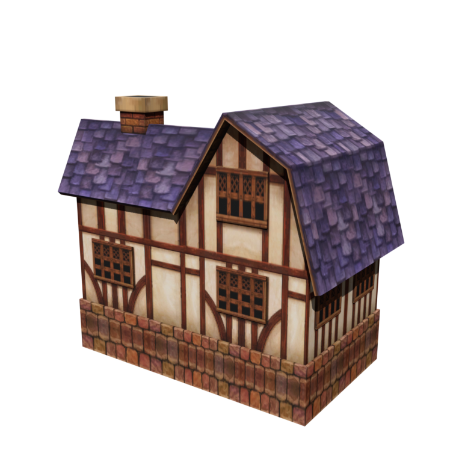 |
| [house01](#house01) | 3 | 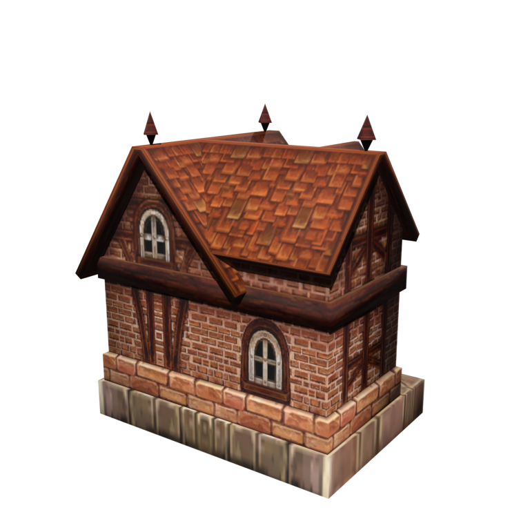 |
| [house02](#house02) | 3 | 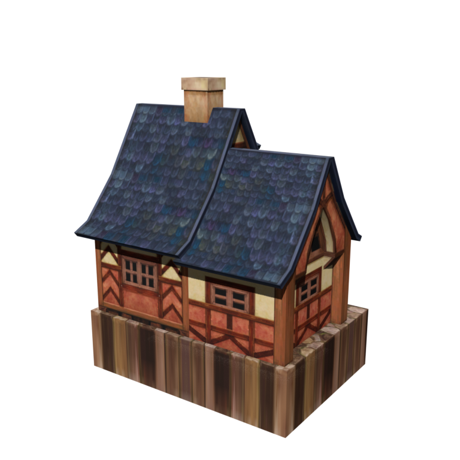 |
| [crystal_colonnade](#crystal_colonnade) | 1 | 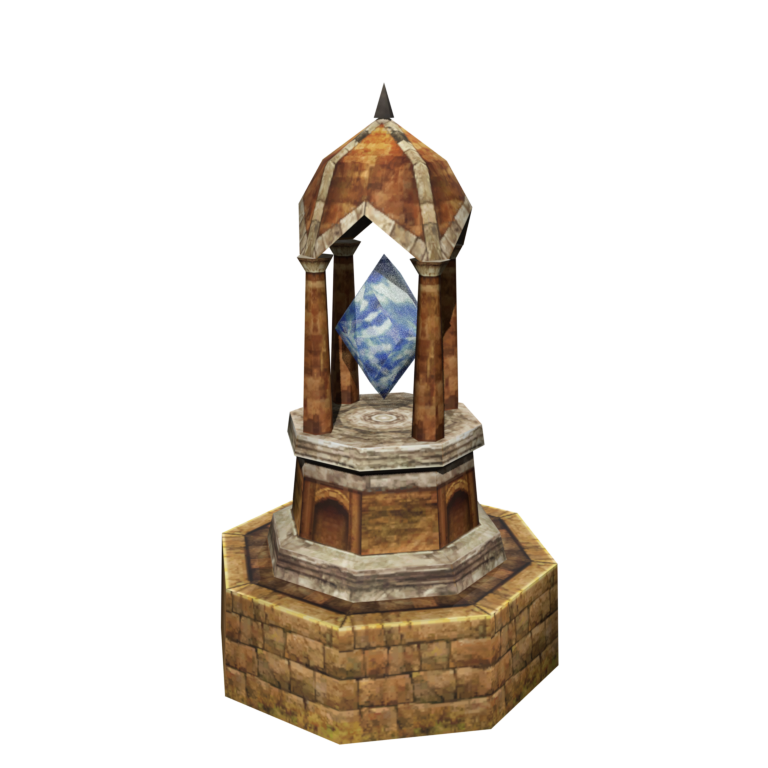 |
| [crystal_pedestal](#crystal_pedestal) | 1 | 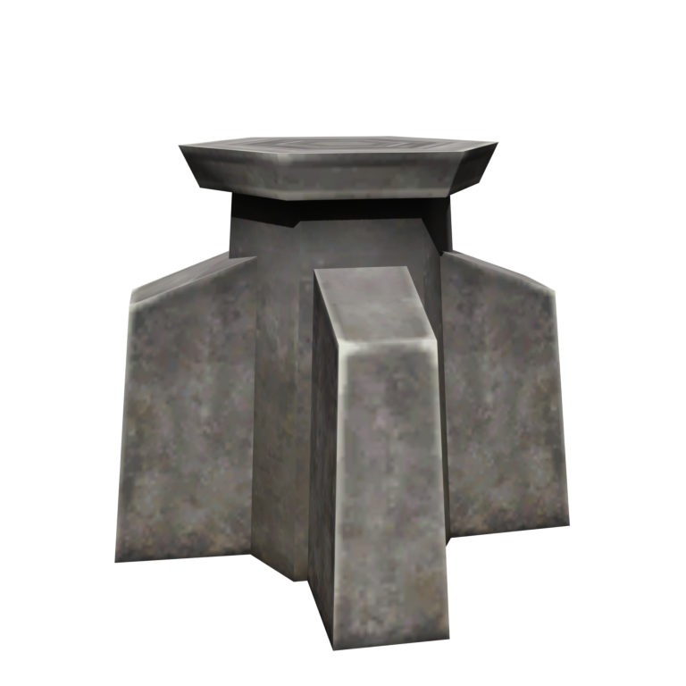 |
| [monument](#monument) | 2 |  |
| [signpost](#signpost) | 2 | 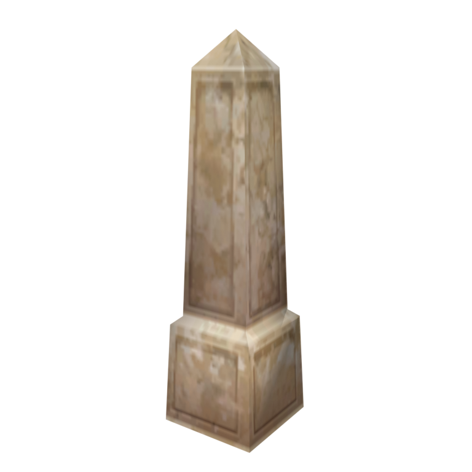 |
| [wood](#wood) | 3 | 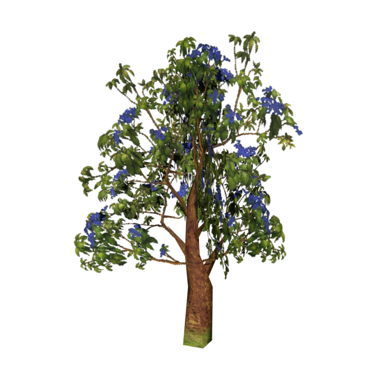 |
| [rock](#rock) | 3 | 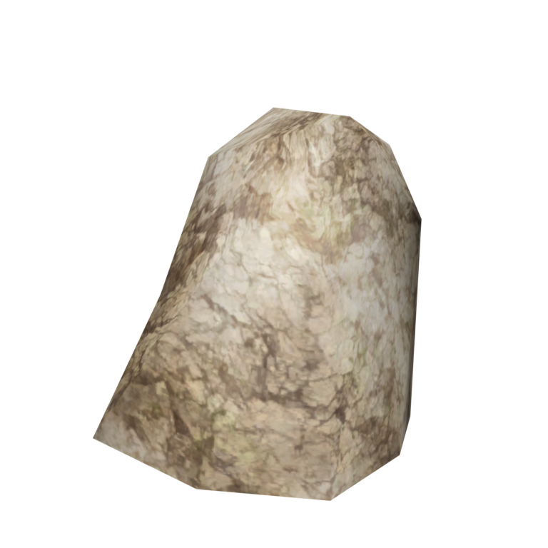 |

## openshop

| プレビュー | モデル | 情報 |
|:---:|---|---|
|  | **Openshop_a** [Blender](openshop/Blender/Openshop_a.blend) / [mdl](openshop/Model/Openshop_a.mdl) / [tex](openshop/Model/Openshop_a.tex) | 頂点 900 / 三角形 502 メッシュ 2 テクスチャ 1枚 |

## alchemy_shop

| プレビュー | モデル | 情報 |
|:---:|---|---|
|  | **b_build00_a** [Blender](alchemy_shop/Blender/b_build00_a.blend) / [mdl](alchemy_shop/Model/b_build00_a.mdl) / [tex](alchemy_shop/Model/b_build00_a.tex) | 頂点 616 / 三角形 442 メッシュ 3 テクスチャ 1枚 |
| 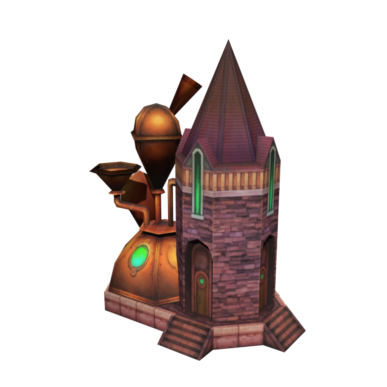 | **b_build00_b** [Blender](alchemy_shop/Blender/b_build00_b.blend) / [mdl](alchemy_shop/Model/b_build00_b.mdl) / [tex](alchemy_shop/Model/b_build00_b.tex) | 頂点 616 / 三角形 442 メッシュ 3 テクスチャ 1枚 |

## arms_store

| プレビュー | モデル | 情報 |
|:---:|---|---|
|  | **arms_store_a** [Blender](arms_store/Blender/arms_store_a.blend) / [mdl](arms_store/Model/arms_store_a.mdl) / [tex](arms_store/Model/arms_store_a.tex) | 頂点 889 / 三角形 532 メッシュ 2 テクスチャ 1枚 |

## magic_store

| プレビュー | モデル | 情報 |
|:---:|---|---|
|  | **magic_store_a** [Blender](magic_store/Blender/magic_store_a.blend) / [mdl](magic_store/Model/magic_store_a.mdl) / [tex](magic_store/Model/magic_store_a.tex) | 頂点 955 / 三角形 681 メッシュ 2 テクスチャ 1枚 |

## bar

| プレビュー | モデル | 情報 |
|:---:|---|---|
|  | **bar_a** [Blender](bar/Blender/bar_a.blend) / [mdl](bar/Model/bar_a.mdl) / [tex](bar/Model/bar_a.tex) | 頂点 1282 / 三角形 702 メッシュ 2 テクスチャ 1枚 |

## inn

| プレビュー | モデル | 情報 |
|:---:|---|---|
|  | **bathroom_a** [Blender](inn/Blender/bathroom_a.blend) / [mdl](inn/Model/bathroom_a.mdl) / [tex](inn/Model/bathroom_a.tex) | 頂点 975 / 三角形 686 メッシュ 2 テクスチャ 1枚 |

## house00

| プレビュー | モデル | 情報 |
|:---:|---|---|
|  | **house00_a** [Blender](house00/Blender/house00_a.blend) / [mdl](house00/Model/house00_a.mdl) / [tex](house00/Model/house00_a.tex) | 頂点 1007 / 三角形 589 メッシュ 1 テクスチャ 1枚 |
| 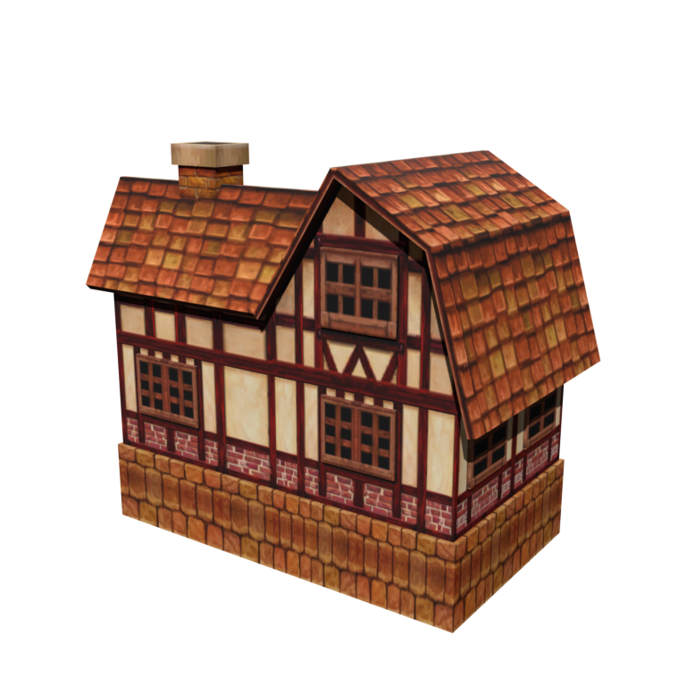 | **house00_b** [Blender](house00/Blender/house00_b.blend) / [mdl](house00/Model/house00_b.mdl) / [tex](house00/Model/house00_b.tex) | 頂点 1007 / 三角形 589 メッシュ 1 テクスチャ 1枚 |
| 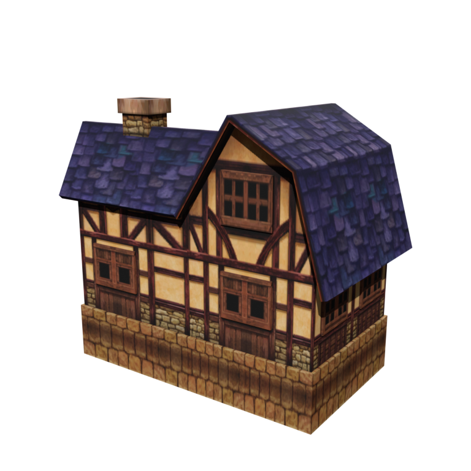 | **house00_c** [Blender](house00/Blender/house00_c.blend) / [mdl](house00/Model/house00_c.mdl) / [tex](house00/Model/house00_c.tex) | 頂点 1007 / 三角形 589 メッシュ 1 テクスチャ 1枚 |

## house01

| プレビュー | モデル | 情報 |
|:---:|---|---|
|  | **house01_a** [Blender](house01/Blender/house01_a.blend) / [mdl](house01/Model/house01_a.mdl) / [tex](house01/Model/house01_a.tex) | 頂点 571 / 三角形 391 メッシュ 3 テクスチャ 1枚 |
| 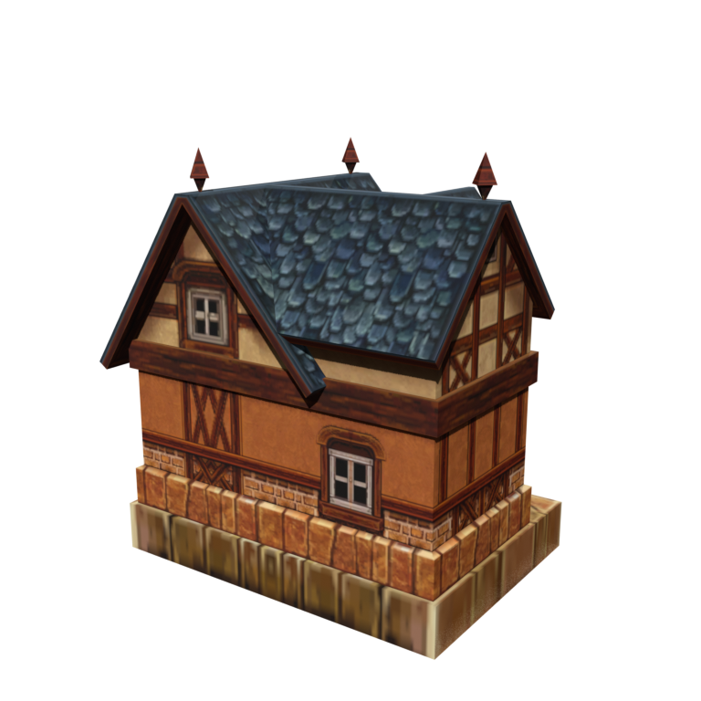 | **house01_b** [Blender](house01/Blender/house01_b.blend) / [mdl](house01/Model/house01_b.mdl) / [tex](house01/Model/house01_b.tex) | 頂点 681 / 三角形 391 メッシュ 3 テクスチャ 1枚 |
| 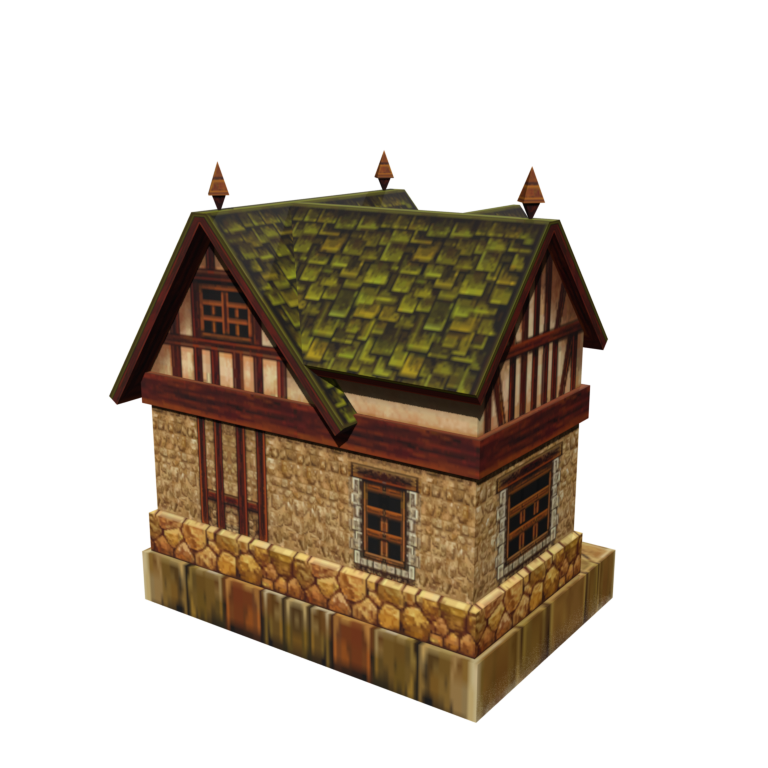 | **house01_c** [Blender](house01/Blender/house01_c.blend) / [mdl](house01/Model/house01_c.mdl) / [tex](house01/Model/house01_c.tex) | 頂点 681 / 三角形 391 メッシュ 3 テクスチャ 1枚 |

## house02

| プレビュー | モデル | 情報 |
|:---:|---|---|
|  | **house02_a** [Blender](house02/Blender/house02_a.blend) / [mdl](house02/Model/house02_a.mdl) / [tex](house02/Model/house02_a.tex) | 頂点 800 / 三角形 472 メッシュ 3 テクスチャ 1枚 |
| 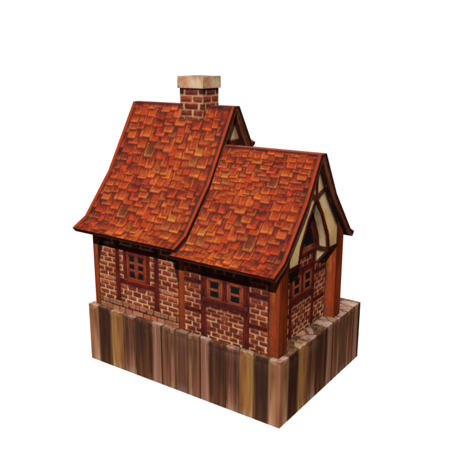 | **house02_b** [Blender](house02/Blender/house02_b.blend) / [mdl](house02/Model/house02_b.mdl) / [tex](house02/Model/house02_b.tex) | 頂点 800 / 三角形 472 メッシュ 3 テクスチャ 1枚 |
| 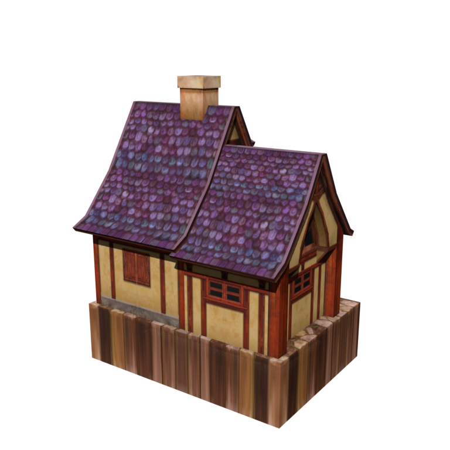 | **house02_c** [Blender](house02/Blender/house02_c.blend) / [mdl](house02/Model/house02_c.mdl) / [tex](house02/Model/house02_c.tex) | 頂点 800 / 三角形 472 メッシュ 3 テクスチャ 1枚 |

## crystal_colonnade

| プレビュー | モデル | 情報 |
|:---:|---|---|
|  | **Crystal_wk** [Blender](crystal_colonnade/Blender/Crystal_wk.blend) / [mdl](crystal_colonnade/Model/Crystal_wk.mdl) / [tex](crystal_colonnade/Model/Crystal_wk.tex) | 頂点 499 / 三角形 326 メッシュ 3 テクスチャ 2枚 |

## crystal_pedestal

| プレビュー | モデル | 情報 |
|:---:|---|---|
|  | **Crystal_ff** [Blender](crystal_pedestal/Blender/Crystal_ff.blend) / [mdl](crystal_pedestal/Model/Crystal_ff.mdl) / [tex](crystal_pedestal/Model/Crystal_ff.tex) | 頂点 213 / 三角形 106 メッシュ 3 テクスチャ 2枚 |

## monument

| プレビュー | モデル | 情報 |
|:---:|---|---|
|  | **monument_a** [Blender](monument/Blender/monument_a.blend) / [mdl](monument/Model/monument_a.mdl) / [tex](monument/Model/monument_a.tex) | 頂点 170 / 三角形 138 メッシュ 1 テクスチャ 1枚 |
| 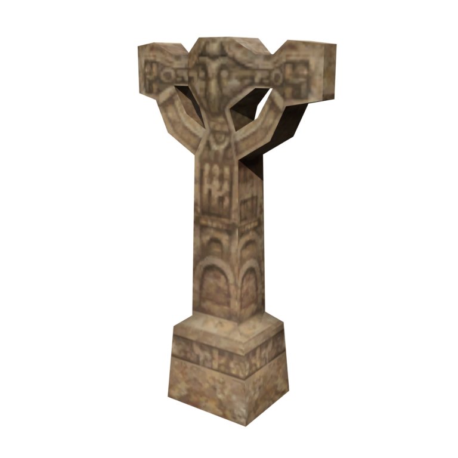 | **monument_b** [Blender](monument/Blender/monument_b.blend) / [mdl](monument/Model/monument_b.mdl) / [tex](monument/Model/monument_b.tex) | 頂点 170 / 三角形 138 メッシュ 1 テクスチャ 1枚 |

## signpost

| プレビュー | モデル | 情報 |
|:---:|---|---|
|  | **signpost_a** [Blender](signpost/Blender/signpost_a.blend) / [mdl](signpost/Model/signpost_a.mdl) / [tex](signpost/Model/signpost_a.tex) | 頂点 36 / 三角形 28 メッシュ 1 テクスチャ 1枚 |
|  | **signpost_b** [Blender](signpost/Blender/signpost_b.blend) / [mdl](signpost/Model/signpost_b.mdl) / [tex](signpost/Model/signpost_b.tex) | 頂点 36 / 三角形 28 メッシュ 1 テクスチャ 1枚 |

## wood

| プレビュー | モデル | 情報 |
|:---:|---|---|
|  | **wood** [Blender](wood/Blender/wood.blend) / [mdl](wood/Model/wood.mdl) / [tex](wood/Model/wood.tex) | 頂点 90 / 三角形 51 メッシュ 3 テクスチャ 2枚 |
| 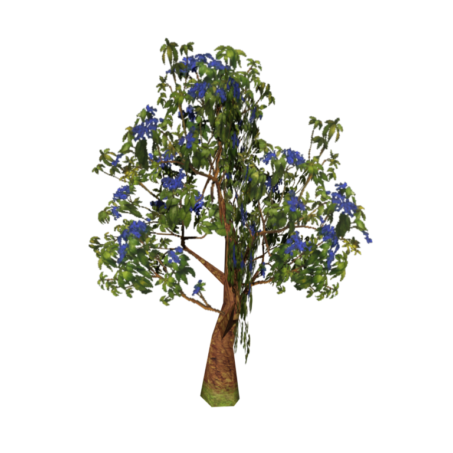 | **wood120** [Blender](wood/Blender/wood120.blend) / [mdl](wood/Model/wood120.mdl) / [tex](wood/Model/wood120.tex) | 頂点 90 / 三角形 51 メッシュ 3 テクスチャ 2枚 |
| 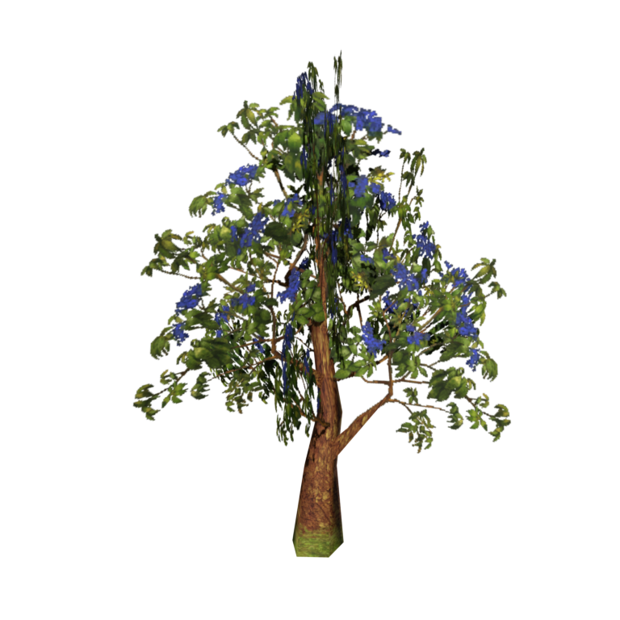 | **wood60** [Blender](wood/Blender/wood60.blend) / [mdl](wood/Model/wood60.mdl) / [tex](wood/Model/wood60.tex) | 頂点 90 / 三角形 51 メッシュ 3 テクスチャ 2枚 |

## rock

| プレビュー | モデル | 情報 |
|:---:|---|---|
|  | **rock** [Blender](rock/Blender/rock.blend) / [mdl](rock/Model/rock.mdl) / [tex](rock/Model/rock.tex) | 頂点 38 / 三角形 44 メッシュ 1 テクスチャ 1枚 |
| 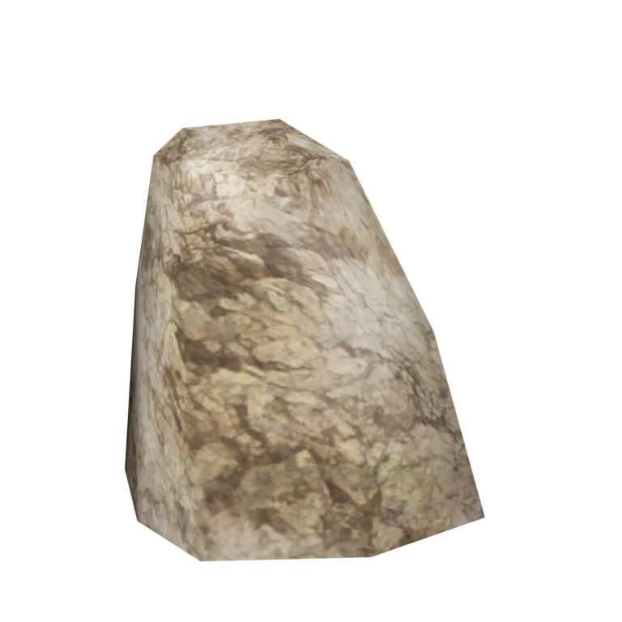 | **rock120** [Blender](rock/Blender/rock120.blend) / [mdl](rock/Model/rock120.mdl) / [tex](rock/Model/rock120.tex) | 頂点 38 / 三角形 44 メッシュ 1 テクスチャ 1枚 |
| 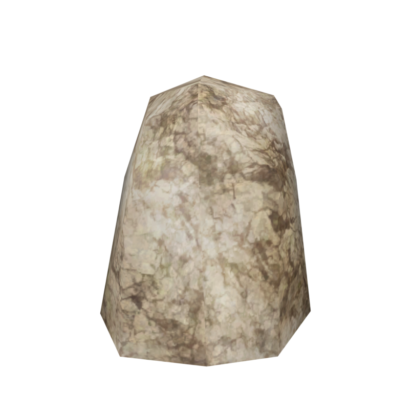 | **rock60** [Blender](rock/Blender/rock60.blend) / [mdl](rock/Model/rock60.mdl) / [tex](rock/Model/rock60.tex) | 頂点 38 / 三角形 44 メッシュ 1 テクスチャ 1枚 |
